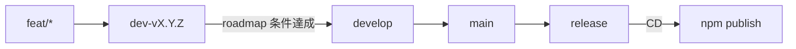

# リポジトリ運用・ブランチ・CI/CD

Playground の公開面、Git ブランチ戦略、CI/CD、docs 系バージョンの運用を定める。  
ライブラリ機能仕様は同ディレクトリ（`api.md` 等）および [main.md](../main.md) が正。本ファイルは **リポジトリ運用の正**。

Git の一般原則は [charter/git-rule.md](../charter/git-rule.md) に従う。本プロジェクト固有の差分は [override-charter.md](../override-charter.md) を優先する。

関連: [charter/](../charter/) / [playground.md](./playground.md) / [docs-site.md](./docs-site.md) / [distribution.md](./distribution.md) / [roadmap.md](../roadmap.md) / [development.md](./development.md)

---

## リモート

| 名称 | URL | 用途 |
|------|-----|------|
| **`origin`** | 社内 `b4m-oss/hyogen-md` | ブランチ同期・社内作業 |
| **`github`** | 公開 `b4moss/hyogen-md` | OSS 正本・CI/CD・Pages |
| **`charter`** | `https://github.com/b4moss/charter.git` | 開発憲章（`docs` ブランチ）。更新時は `git fetch charter` → `git merge charter/docs` |

憲章の取り込み方式は [charter/README.md](../charter/README.md) を参照。プロジェクト側で憲章ファイルを上書き・削除しない。

---

## バージョン（docs トラック）

本節以降の「Playground 公開・ブランチ整備・CI/CD」など **リポジトリ／ドキュメント／配布導線** の作業は、次の版系列で進める。

| 項目 | 方針 |
|------|------|
| 形式 | **`v0.10.0-docs.n`**（`n` は 1 からインクリメント） |
| 意味 | `v0.10.0` 製品線上の **docs / インフラ / 導線** 向けマーカー。機能 MINOR（`v0.11.0` 等）とは別トラック |
| git tag | 作業単位の区切りで **`v0.10.0-docs.n`** を付与してよい |
| npm | **docs タグだけでは publish しない**。npm 公開は後述の **`release` ブランチへのマージ**（および tag ↔ version 一致）に限定 |
| ライブラリ `package.json` | docs 作業のみでは **上げない**（機能／パッケージリリース時に SemVer を上げる） |

機能開発の SemVer（`v0.n.0` / PATCH）は従来どおり [roadmap.md](../roadmap.md) に従う。

---

## 長期ブランチ

| ブランチ | 役割 |
|----------|------|
| **`develop`** | 現行どおりの統合・開発のハブ。マイルストーン完了物を受け取る |
| **`main`** | **いつでもリリース可能な状態**を保つブランチ。安定版の正 |
| **`release`** | **実際に npm へ出すパッケージ**のためのブランチ。ここへのマージが CD のトリガ |
| **`doc-site`** | **ドキュメントサイト（GitHub Pages）用**の長期ブランチ。ここへのマージが Pages CD のトリガ |

初期化時は、現状の安定点（例: `v0.10.0` 相当の `develop`）から `main` / `release` を作成する（実施済み。履歴は [_archived/roadmap/v0.10.0-docs.md](../_archived/roadmap/v0.10.0-docs.md)）。`doc-site` は `main` から分岐する。

---

## バージョン開発ブランチ

| ブランチ | 命名例 | 役割 |
|----------|--------|------|
| マイルストーン開発 | **`dev-v{major}.{minor}.{patch}`**（例: `dev-v0.11.0`） | その版の roadmap 条件を満たすまでの作業統合先 |
| 機能 | **`feat/...`**（またはチーム慣例の feat 接頭） | 1 機能単位。**`dev-v…` へマージ**する |
| ドキュメント／導線 | **`docs/...`** または docs トラック用ブランチ | **サイト公開向けは `doc-site` へ PR**。ライブラリ同梱 README 等のみ `main` 例外可（後述） |
| 緊急修正 | **`hotfix/...`** | **`main` へ PR（CI あり）したうえで `release` へマージ**する場合がある（後述） |

---

## 通常のマージフロー（機能リリース）

前提: 対象マイルストーンの開発ブランチを `dev-v{n}.{n}.{n}` とする。

1. **`feat/*` → `dev-vX.Y.Z`**（**PR 必須・app CI**）  
   機能ごとにブランチを切り、マイルストーン開発ブランチへ統合する。**`dev-v*` への直接 push は禁止**（PR 経由のみ。Ruleset での強制は PO が管理画面で後日）。
2. **`dev-vX.Y.Z` → `develop`**（**CI なし**）  
   [roadmap.md](../roadmap.md) 上、当該版の受け入れ条件を満たしたら `develop` へマージする。
3. **`develop` → `main`**（**CI なし**）  
   リリース候補を安定ブランチへ載せる。
4. **`main` → `release`**（**CI なし**）  
   パッケージとして出すタイミングで `release` へマージする。
5. **`release` へのマージ → npm publish（CD）**  
   後述。

`develop` 自体の役割・運用は **現状維持**（日々の統合ハブ）。app CI は **`dev-v*` 向け PR で 1 回通れば十分**とし、以降の昇格では再実行しない（憲章差分は [override-charter.md](../override-charter.md)）。

---

## 例外フロー

### docs 系（サイト公開は `doc-site`）

反映ルール（**C**）:

1. **ドキュメントサイト・Playground・ユーザー向け docs の変更**は **`doc-site` 向け PR** とする（docs CI: `test-pg` + `build-docs`）。マージで Pages CD が走る。
2. **`main` にライブラリ変更が入ったあと**は、必要に応じて **`main` → `doc-site` を sync**（merge または PR）し、API / Playground を追従させる。
3. **npm 同梱の README・配布導線のみ**など、サイト非公開の変更は従来どおり **`main` へ直接マージしてよい**場合がある（サイトは `doc-site` 経由）。
4. docs トラックの版付けは **`v0.10.0-docs.n`**。`site-*` タグによるデプロイは用いない。

### hotfix

- 緊急修正は **`hotfix/*` → `main` の PR**（**app CI あり**）で入れたうえで、必要なら **`release` へマージ**する。
- `release` へ入れば通常どおり CD で npm 公開対象になる（版番号・tag 方針はリリース時に SemVer で決める）。

### `main` への直接マージ禁止

- **通常、`main` への直接マージは禁止**する（PR 経由でも、原則は `develop` → `main` または許可された hotfix / README 例外経路）。
- **例外:** GitHub ユーザー **`@kohki-shikata`** が **force push** した場合は、直接更新を受け入れる（運用上のエスケープハッチ）。

---

## Playground / ドキュメントサイトの公開（GitHub Pages）

製品仕様: [docs-site.md](./docs-site.md)。

| 項目 | 方針 |
|------|------|
| サイト | **`docs-site/`**（Nuxt Content）。Playground は **`/playground`** に統合済み |
| テーマ | dark / light / system をサイトと Playground で共有 |
| デプロイ | **`doc-site`** への push（マージ含む）。Workflow [`.github/workflows/pages.yml`](../../.github/workflows/pages.yml) で `app/` + `docs-site/` をビルドし Pages へ |
| URL | **https://hyogenmd.oss.b4m.jp**（Playground: `/playground`）。独自ドメインは `docs-site/public/CNAME` |
| npm | サイト・Playground とも **含めない** |

### GitHub Pages 接続手順（参照用）

1. リポジトリ **Settings → Pages** で Source を **GitHub Actions** にする
2. 独自ドメイン **`hyogenmd.oss.b4m.jp`** を設定し、DNS で Pages へ向ける（CNAME ファイルはリポジトリ側に同梱）
3. **Settings → Environments → `github-pages`** の **Deployment branches** に **`doc-site`** を許可する（Custom ポリシー）。`main` のみだと Deploy job が環境保護で拒否される
4. 以降 **`doc-site`** への push（または `workflow_dispatch`）で自動デプロイ

---

## CI（GitHub Actions）

| トリガ | Workflow | 内容 |
|--------|----------|------|
| **PR** base **`dev-v*`**（`app/**` 等） | [`.github/workflows/ci.yml`](../../.github/workflows/ci.yml) | app: `make check` |
| **PR** **`hotfix/*` → `main`**（同上 paths） | 同上 | app: `make check`（通常の `develop`→`main` では job を skip） |
| **PR** base **`doc-site`**（`docs-site/**` / `app/**` 等） | [`.github/workflows/ci-docs.yml`](../../.github/workflows/ci-docs.yml) | `make test-pg` + `make build-docs` |
| **`develop` / `main` / `release` への通常昇格 PR** | — | **機能 CI なし**（`dev-v*` で通済みとみなす） |

`paths` フィルタで docs / specs のみの変更では app / docs CI を起動しない。ローカルでは PR 前に **`make act`** で app CI 相当を再現できる（[development.md](./development.md)）。

### Quality（Codecov / Scorecard / CodeQL）

| トリガ | Workflow | 内容 |
|--------|----------|------|
| **`main` への push**（`app/**` 等） | [`.github/workflows/quality.yml`](../../.github/workflows/quality.yml) | app coverage → Codecov upload |
| **週次 cron**（+ `workflow_dispatch` / branch protection） | [`.github/workflows/scorecard.yml`](../../.github/workflows/scorecard.yml) | OpenSSF Scorecard（毎 push では走らない） |
| **`main` push**（`app/**` / workflows）**+ 週次 cron** | [`.github/workflows/codeql.yml`](../../.github/workflows/codeql.yml) | CodeQL SAST（`javascript-typescript` / `actions`）。昇格 PR では走らない |

依存インストールは Scorecard **Pinned-Dependencies** 向けに **`npm ci`**（lockfile の integrity）を使う。docs-site も同様（lockfile は Linux CI で再生成可能な状態を維持）。

**必須:** GitHub Code scanning の **default setup は無効**にし、advanced workflow（`codeql.yml`）のみにする。両方有効だと同一コミットで CodeQL が二重起動する。Settings → Code security → Code scanning → Default setup → Disable。

### CD（docs site）

| 項目 | 方針 |
|------|------|
| トリガ | **`doc-site` への push**（`docs-site/**` / `app/**` 等。および手動 `workflow_dispatch`） |
| Workflow | [`.github/workflows/pages.yml`](../../.github/workflows/pages.yml) |
| 動作 | `make build-docs` のあと `actions/deploy-pages` で公開 |

---

## CD（npm publish）

| 項目 | 方針 |
|------|------|
| トリガ | **`release` への push**（マージ含む） |
| Workflow | [`.github/workflows/publish.yml`](../../.github/workflows/publish.yml) |
| 動作 | `app/` で build のあと `npm publish --access public --provenance`（Trusted Publishing / OIDC） |
| 既存版 | registry に **同じ `name@version` がある場合は publish をスキップ**（成功終了）。初期 `release` = `0.10.0` でも再公開しない |
| 版 | git tag と `app/package.json` の version を **一致**させてから `release` へ載せる |
| Auth | 長期 `NPM_TOKEN` は使わない。npm パッケージの **Trusted Publisher（GitHub Actions）** + workflow `permissions.id-token: write` |

### Trusted Publisher の設定手順

1. [npmjs.com](https://www.npmjs.com/package/@b4moss/hyogen-md) → Access → Trusted Publisher
2. GitHub Actions を選び、リポジトリ **`b4moss/hyogen-md`**、Workflow ファイル名 **`publish.yml`**（パスなし）を登録
3. 動作確認後、不要になった GitHub Secrets の `NPM_TOKEN` があれば削除

初回公開済みの前提・パッケージ境界は [distribution.md](./distribution.md)。

---

## ブランチ保護・権限

対象は **GitHub `b4m-oss/hyogen-md`**（社内 `origin` はブランチ同期のみでよい）。

| ブランチ | 設定 |
|----------|------|
| `main` | PR 必須。**Allow force pushes = ON**（クラシック保護。Rulesets でアクター限定を推奨） |
| `release` | PR 必須。force push 不可。マージ後の push で CD 起動 |
| `develop` | PR 必須。force push 不可 |
| `dev-v*` | **直接 push 禁止**（PR 経由のみ）。Ruleset での強制は PO が管理画面で後日 |
| `doc-site` | Pages CD 用。サイト変更は PR 経由を推奨 |

---

## まとめ（チェックリスト）

- [x] 長期ブランチ `main` / `release` を用意（`develop` は維持）
- [x] 長期ブランチ `doc-site`（Pages CD。`main` から分岐）
- [x] 以降の機能は `feat/*` → `dev-vX.Y.Z` → `develop` → `main` → `release`（方針確定）
- [x] サイト docs は `doc-site` 向け PR + `main` 後 sync（方針確定）
- [x] hotfix は `hotfix/*` → `main`（CI）→ `release` 可（方針確定）
- [x] app CI: PR → `dev-v*` / `hotfix/*`→`main`（`.github/workflows/ci.yml`）
- [x] docs CI: PR → `doc-site`（`.github/workflows/ci-docs.yml`）
- [x] Quality: `main` push（app paths）→ Codecov（`.github/workflows/quality.yml`）；Scorecard は週次；CodeQL は advanced のみ（default setup 無効）+ `main` paths / 週次
- [x] CD: `release` マージ → npm publish（`.github/workflows/publish.yml` + 既存版スキップ）
- [x] ドキュメントサイトを GitHub Pages 公開し、README から導線（`.github/workflows/pages.yml` + `https://hyogenmd.oss.b4m.jp`）
- [x] ドキュメントサイト（docs.5〜8）: Nuxt Content・Playground 内包・テーマ・API/構文網羅 → [docs-site.md](./docs-site.md)

以上
